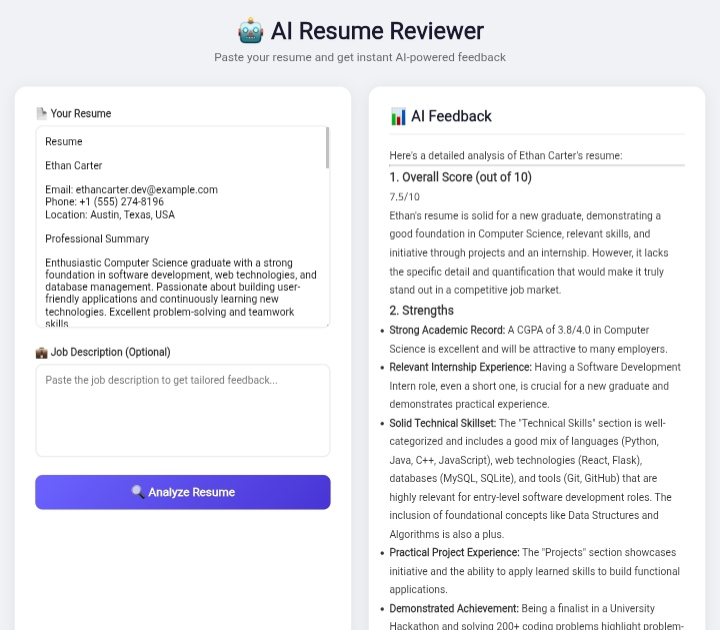

# AI Resume Reviewer 🤖

An AI-powered resume reviewer built with Flask and the Google Gemini API. Paste in a resume and get instant, structured feedback — including a score, strengths and weaknesses, and specific suggestions for improvement.

**🔗 Live Demo:** [resume-reviewer-gs55.onrender.com](https://resume-reviewer-gs55.onrender.com)

## Features
- Paste your resume text and get instant AI-generated feedback
- Overall score out of 10
- Strengths and weaknesses breakdown
- Specific, actionable improvement suggestions
- Missing keyword detection
- Optional job description matching for tailored, role-specific feedback

## Tech Stack
| Layer | Technology |
|---|---|
| Backend | Python, Flask |
| AI/API | Google Gemini API |
| Frontend | HTML, CSS, Jinja2 |
| Deployment | Render (cloud-hosted) |

## How It Works
1. User pastes their resume text into the app (optionally with a target job description)
2. Flask sends the input to the Google Gemini API with a structured prompt
3. Gemini analyzes the resume and returns feedback covering score, strengths, weaknesses, suggestions, and missing keywords
4. The app renders this feedback back to the user in a clean, readable format

## Running Locally
\`\`\`bash
git clone <your-repo-url>
cd resume-reviewer
pip install flask google-genai markdown
python app.py
\`\`\`
Then open http://127.0.0.1:5003

## Cloud Deployment
This app is deployed on Render, making it accessible as a live cloud-hosted service rather than a local-only application.